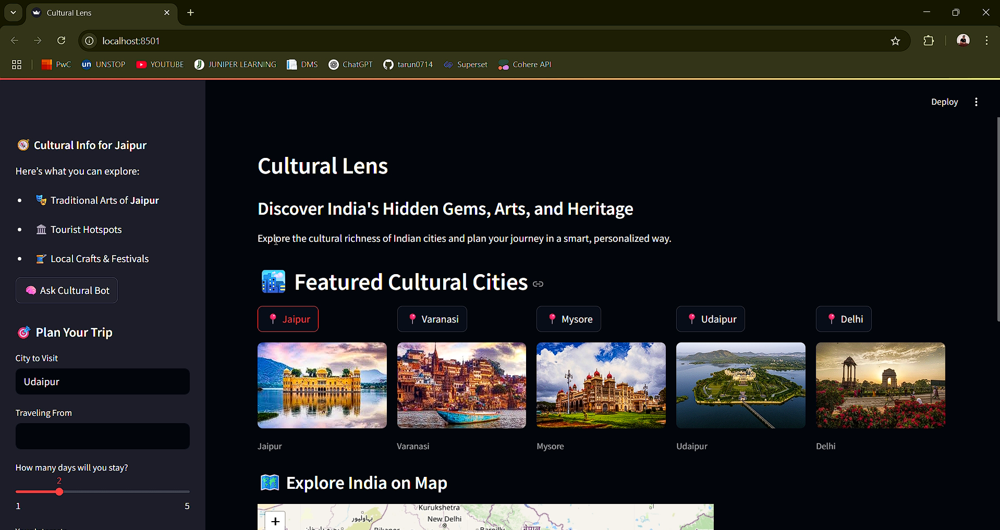

# 🧭 Cultural Lens

### Discover the cultural richness of India — interactively powered by AI.



---

## 📌 Overview

**Cultural Lens** is a map-integrated AI-powered tourism assistant that helps users explore India's hidden cultural gems. From local art forms to traditional festivals, the app generates personalized itineraries and cultural insights using the **Cohere LLM** API.

---

## 🚀 Features

- 🗺️ Interactive map: Click anywhere in India to discover nearby culture
- 📸 Image-driven city explorer with uniform layout
- 🤖 AI-powered itinerary generation (via Cohere `command-light`)
- 🧵 Traditional arts, crafts, and food insights with chatbot
- 🌐 Built using Python & Streamlit

---

## 🎥 Demo Video

[Watch the demo on YouTube](https://youtu.be/RMNh-AutYL0)

---

## 🏗️ Tech Stack

- **Frontend**: Streamlit
- **Backend AI**: Cohere API (`command-light`)
- **Map Engine**: Folium + streamlit-folium
- **Geolocation**: Geopy (reverse geocoding)
- **Media**: PIL for image processing

---

## 📁 Project Structure

```
cultural_lens/
│
├── main.py
├── requirements.txt
├── .streamlit/
│   └── secrets.toml
├── assets/
│   └── city_images/
├── sections/
│   ├── landing.py
│   ├── map_click.py
│   ├── itinerary_bot.py
│   └── city_info.py
```

---

## ⚙️ Setup Instructions

1. **Clone the repo**
   ```bash
   git clone https://github.com/tarun0714/Cultural_compass
   cd cultural-lens
   ```

2. **Install dependencies**
   ```bash
   pip install -r requirements.txt
   ```

3. **Configure your Cohere API key**

   Create `.streamlit/secrets.toml`:
   ```toml
   COHERE_API_KEY = "your-api-key-here"
   ```

4. **Run the app**
   ```bash
   streamlit run main.py
   ```

---

## 🤝 Credits

- **Developer**: [TARUN](https://github.com/tarun0714)
- **API**: [Cohere Command Models](https://cohere.com/)
- **Geolocation**: [Geopy](https://geopy.readthedocs.io/)
- **Maps**: [Folium](https://python-visualization.github.io/folium/)

---

## 📜 License

Free to use with attribution.
